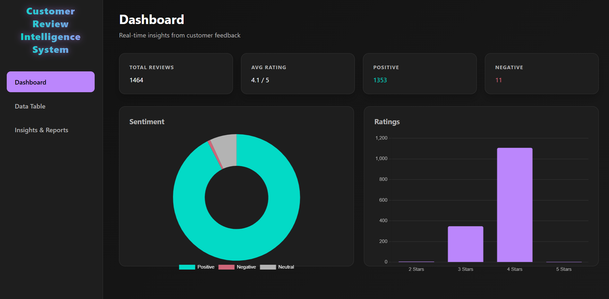
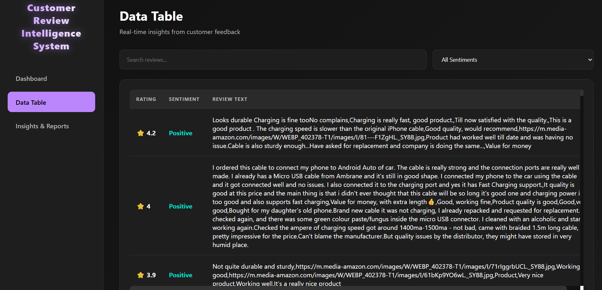
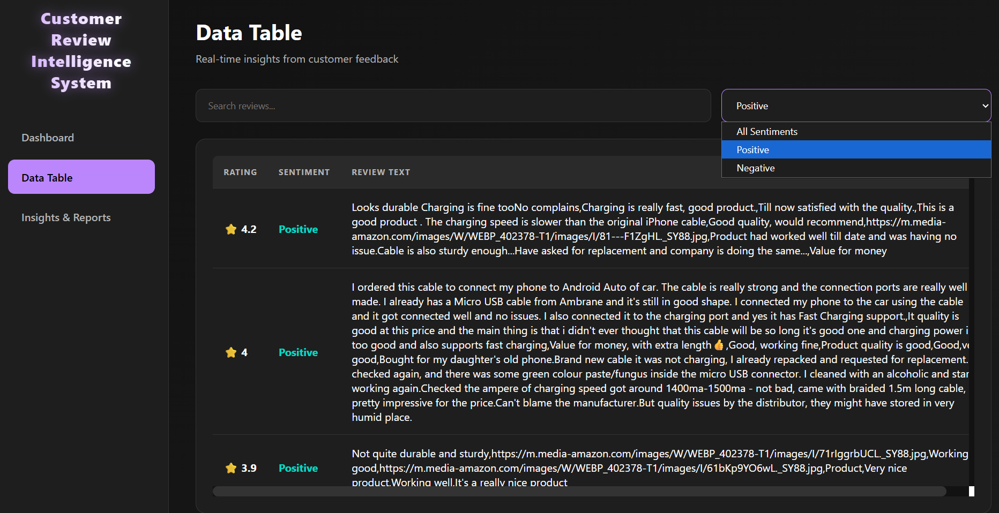
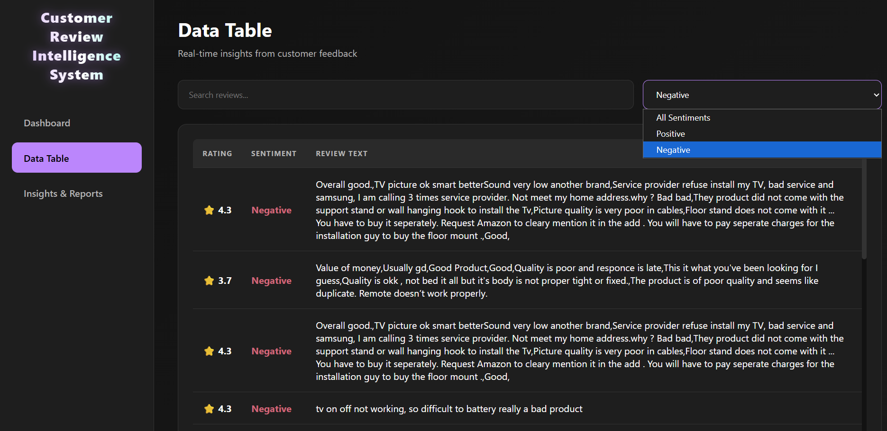
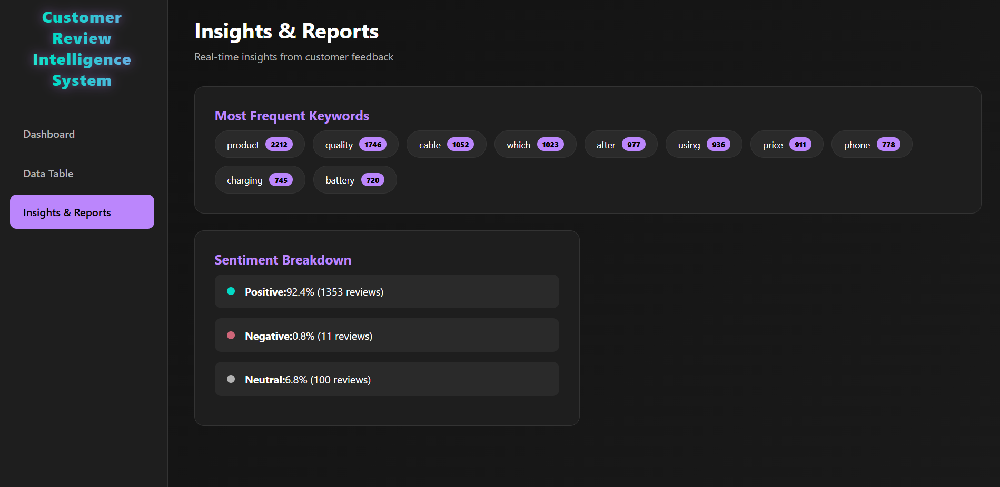

# 🚀 Customer Review Intelligence System

> A Full-Stack NLP-Powered Analytics Platform

---

## 📌 Overview

This repository contains the source code and documentation for the **Customer Review Intelligence System**, an end-to-end full-stack web application designed to ingest raw e-commerce product reviews, perform Natural Language Processing (NLP)-based sentiment analysis, and present actionable insights through an interactive analytics platform.

The system processes a dataset of **1,464 Amazon product reviews** (Charging Cables & Electronics Accessories).

---

## 🎯 Features

* 🔄 **Data Ingestion**
  Automatically loads and parses a CSV file containing review text and star ratings.

* 🧠 **Sentiment Classification**
  Uses the TextBlob library to classify reviews into **Positive, Negative, or Neutral** based on polarity scores.

* 📊 **Statistical Aggregation**
  Computes key metrics such as total reviews, average rating, and sentiment distribution.

* 🔑 **Keyword Extraction**
  Identifies the top 10 most frequent keywords from the review dataset.

* 📈 **Interactive Visualization**
  Displays insights using a modern dashboard with:

  * Doughnut chart (sentiment)
  * Bar chart (ratings)
  * Searchable & filterable data table

---

## 🏗️ Technology Stack

* **Backend:** Python 3.11, Flask, Flask-CORS
* **Data & NLP:** Pandas, TextBlob
* **Frontend:** HTML, CSS, JavaScript, Chart.js

---

## 🧩 System Architecture

The system follows a **three-tier architecture**:

* **Presentation Layer:** HTML, CSS, JavaScript (Dashboard UI)
* **Application Layer:** Flask (REST API)
* **Data Layer:** CSV dataset processed using Pandas

---

## 🔌 REST API Endpoints

| Endpoint     | Method | Description                                      |
| ------------ | ------ | ------------------------------------------------ |
| `/`          | GET    | Loads dashboard UI                               |
| `/api/stats` | GET    | Returns KPI and sentiment data                   |
| `/reviews`   | GET    | Returns all processed reviews                    |
| `/report`    | GET    | Returns keyword insights and sentiment breakdown |

---

## ⚙️ Setup & Execution

### 1️⃣ Install Dependencies

```bash
pip install flask pandas textblob flask-cors
python -m textblob.download_corpora
```

### 2️⃣ Place Dataset

Ensure `reviews.csv` is in the root directory (same level as `app.py`).

### 3️⃣ Run Application

```bash
python app.py
```

### 4️⃣ Open Dashboard

Visit:

```
http://localhost:5000
```

---

## 📂 Project Structure

```text
customer-review-intelligence-system/
├── app.py
├── reviews.csv
├── requirements.txt
├── templates/
│   └── index.html
├── static/
│   ├── style.css
│   └── script.js
├── dashboard.png
├── datatable.png
├── datatable_filter.png
├── negative_filter.png
├── insights.png
```

---

## 📸 Screenshots

### 📊 Dashboard



### 📋 Data Table



### 🔍 Filtered Data



### ❌ Negative Reviews



### 💡 Insights



---

## 🚧 Future Improvements

* 🤖 Replace TextBlob with BERT for better accuracy
* 🧹 Improve keyword extraction using NLTK
* 🗄️ Add database support (SQLite/PostgreSQL)
* 📤 Enable CSV upload via UI
* ☁️ Deploy on cloud (AWS / Render)

---

## 👨‍💻 Author

**Sambhav Jha**
Roll No: 2306343
KIIT University

---

## ⭐ Notes

* Ensure repository is **public**
* Upload all required project files
* Screenshots must be visible in README
